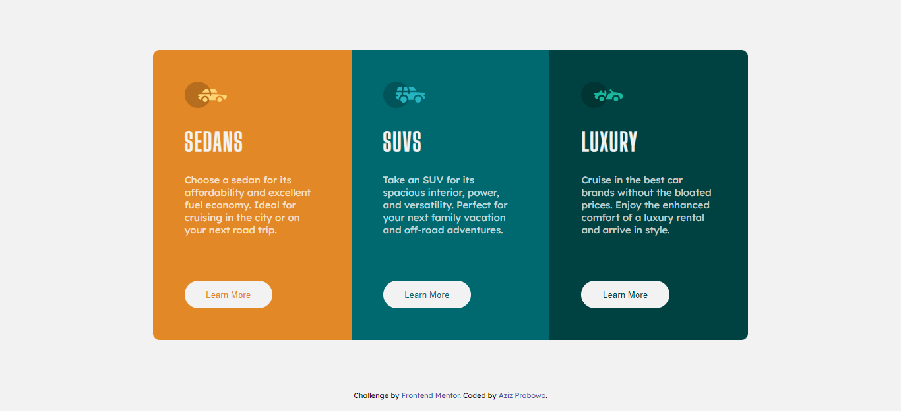

# Frontend Mentor - 3-column preview card component solution

This is a solution to the [3-column preview card component challenge on Frontend Mentor](https://www.frontendmentor.io/challenges/3column-preview-card-component-pH92eAR2-). Frontend Mentor challenges help you improve your coding skills by building realistic projects.

## Table of contents

- [Overview](#overview)
  - [The challenge](#the-challenge)
  - [Screenshot](#screenshot)
  - [Links](#links)
- [My process](#my-process)
  - [Built with](#built-with)
  - [What I learned](#what-i-learned)
- [Author](#author)

## Overview

### The challenge

Users should be able to:

- View the optimal layout depending on their device's screen size
- See hover states for interactive elements


### Screenshot



### Links

- Solution URL: [SOLUTION](https://www.frontendmentor.io/solutions/responsive-3-column-preview-card-using-css-flexbox-yQCb-6n2nI)
- Live Site URL: [LIVE SITE](https://azizp128.github.io/3-column-preview-card/)

## My process

### Built with

- Semantic HTML5 markup
- CSS custom properties
- Flexbox
- Mobile-first workflow

### What I learned

I learned about responsive design in this challenge. The tip is to avoid using fixed size (width, height, px) on your design.

To see how you can add code snippets, see below:

```css
.card .card-1 .button-1,
.card .card-2 .button-2,
.card .card-3 .button-3 {
  min-width: 10em;
  min-height: 3.2em;
  border-radius: 100px;
  border: 0;
  margin-top: 10px;
  cursor: pointer;
}
```

## Author

- Frontend Mentor - [@azizp128](https://www.frontendmentor.io/profile/azizp128)
- Twitter - [@azizprbw](https://www.twitter.com/azizprbw)
